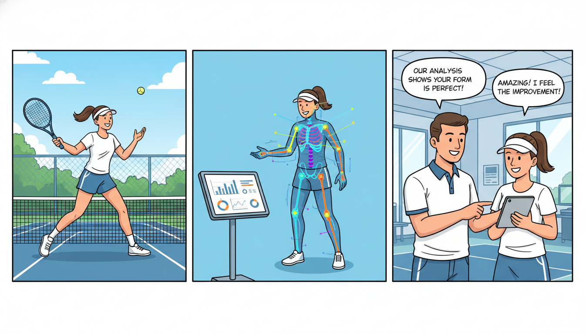

# Tennis Pose Estimation & Data Analysis

This repository provides a specialized computer vision pipeline for detecting and analyzing human poses in tennis footage. Using the `pose_est.ipynb` notebook and advanced pose estimation models, this project extracts skeletal keypoints from video data to assist in biomechanical analysis and player movement tracking.

## 🎾 Project Overview

Analyzing a tennis player's form—such as the serve, backhand, or footwork—requires precise tracking of joint positions. This project leverages Computer Vision (CV) to:
- Detect 33+ body keypoints (using MediaPipe or similar frameworks).
- Track movement across frames in high-speed tennis footage.
- Provide a foundation for data-driven coaching and performance metrics.

The repository includes a sample video of Rafael Nadal (`nadal.mp4`) to demonstrate the estimator's accuracy on professional-grade movement.

## 🚀 Features

*   **Real-time Pose Tracking:** Efficient processing of video frames to identify skeletal structures.
*   **Joint Angle Calculation:** Logic to calculate angles (e.g., elbow extension during a serve or knee flexion during a baseline rally).
*   **Data Visualization:** Overlays the detected skeleton onto the video and generates analytical plots.
*   **Exportable Metrics:** Capability to save keypoint coordinates to CSV/JSON for further statistical analysis.

## 🛠️ Installation

1. **Clone the repository:**
   ```bash
   git clone https://github.com/your-username/data_analysis-pose_estimator_tennis.git
   cd data_analysis-pose_estimator_tennis
   ```

2. **Create a virtual environment (optional but recommended):**
   ```bash
   python -m venv venv
   source venv/bin/activate  # On Windows: venv\Scripts\activate
   ```

3. **Install dependencies:**
   You will need `opencv`, `mediapipe`, `numpy`, and `matplotlib`.
   ```bash
   pip install opencv-python mediapipe numpy matplotlib jupyter
   ```

## 💻 Usage

The core logic is contained within the Jupyter Notebook.

1. Launch Jupyter Lab or Notebook:
   ```bash
   jupyter notebook
   ```
2. Open `pose_est.ipynb`.
3. Run the cells sequentially. The notebook is configured to:
    *   Load the `nadal.mp4` video.
    *   Initialize the Pose Estimation model.
    *   Process frames and render the output.
    *   Display a window with the tracked pose.

### Code Snippet Example
Here is a simplified look at the pose detection logic used in the notebook:

```python
import cv2
import mediapipe as mp

# Initialize MediaPipe Pose
mp_pose = mp.solutions.pose
pose = mp_pose.Pose(static_image_mode=False, min_detection_confidence=0.5)

cap = cv2.VideoCapture('nadal.mp4')

while cap.isOpened():
    ret, frame = cap.read()
    if not ret:
        break

    # Convert to RGB for MediaPipe
    image_rgb = cv2.cvtColor(frame, cv2.COLOR_BGR2RGB)
    results = pose.process(image_rgb)

    # Draw landmarks on the frame
    if results.pose_landmarks:
        mp.solutions.drawing_utils.draw_landmarks(
            frame, results.pose_landmarks, mp_pose.POSE_CONNECTIONS)

    cv2.imshow('Tennis Pose Estimation', frame)
    if cv2.waitKey(1) & 0xFF == ord('q'):
        break

cap.release()
cv2.destroyAllWindows()
```

## 📁 Repository Structure

*   `pose_est.ipynb`: The main execution script containing the video processing pipeline and data visualization logic.
*   `nadal.mp4`: A high-quality sample video used for testing the pose estimator's performance during high-intensity movement.

## 📊 Potential Analysis

By running this estimator, you can extract insights such as:
- **Serve Kinematics:** Measuring the maximum height of the racquet arm.
- **Lateral Agility:** Calculating the speed of hip movement across the baseline.
- **Stance Stability:** Analyzing the center of gravity during various stroke phases.

## 🛠 Future Improvements

- [ ] Support for multi-player tracking (Doubles analysis).
- [ ] Automated stroke classification (Identify Serve vs. Forehand vs. Backhand).
- [ ] 3D Pose reconstruction from 2D video feeds.

## 📄 License

This project is open-source. Please check the LICENSE file for more details. (Defaulting to MIT if not specified).

---
*Developed for sports scientists, tennis enthusiasts, and data analysts.*